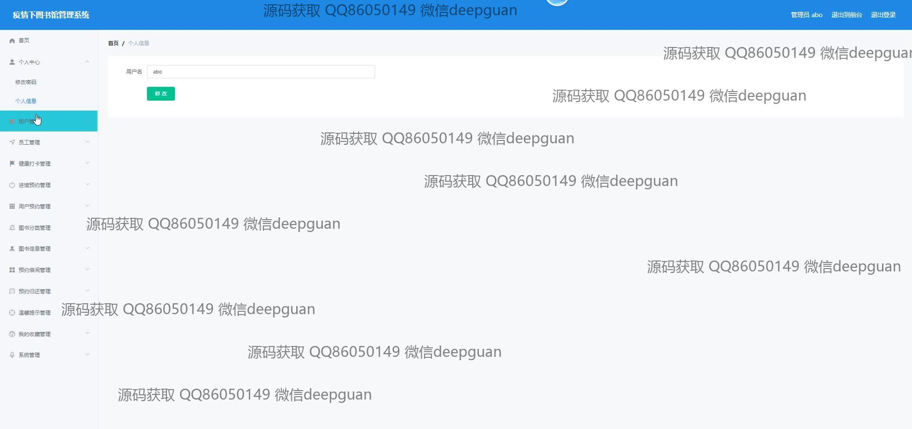
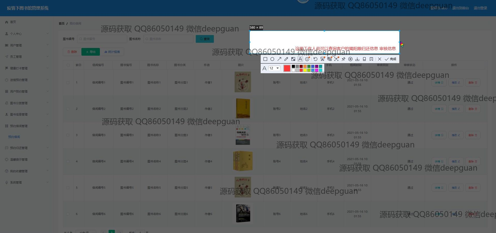

<h1 align="center">疫情下图书馆管理系统</h1>

## 简介
疫情下图书馆管理系统：基于Spring Boot开发，角色分为管理员、用户和员工；功能包括健康打卡管理、进馆预约管理、图书借阅管理、用户信息管理和图书分类管理，旨在提高疫情期间图书馆管理效率和用户体验。    --计算机毕业设计源码；毕设源码；java毕业设计源码

## 联系方式

<h3 align="center">获取完整代码与数据库文件 + 微信：deepguan QQ: 86050149 QQ群: 783742310</h3>

<h3 align="center">可帮忙远程部署 包运行成功！提供远程部署、修改代码、设计文档指导、代码讲解等服务！</h3>

## 功能介绍（完整见运行截图）
管理员：管理员通过身份验证管理图书馆的整体操作，包括用户管理、书籍管理、预约管理和健康打卡管理。系统支持添加、编辑和删除图书信息，审核和管理图书借阅和预约状态，确保流畅的预约借阅流程。管理员可以追踪用户的健康状态，确保进入图书馆的安全性，同时可以通过系统便捷管理员工和学生的信息。顶部导航栏和分立的功能模块使管理员能够快速访问所需功能，提高工作效率。

用户：用户通过注册或登录访问系统，能够进行个人信息的查看和修改，包括更改密码和联系方式等。系统提供方便的书籍搜索和分类浏览功能，用户可以预约进馆和借阅图书并管理个人的预约记录。图书馆开放时间、推荐书单及新书资讯提供用户友好体验。用户还能通过健康打卡功能报告个人健康状况并确认预约借阅申请。整个系统设计简洁直观，适用于疫情期间的无接触图书馆服务。

## 运行截图

本代码来源于网络,仅供学习参考使用!

